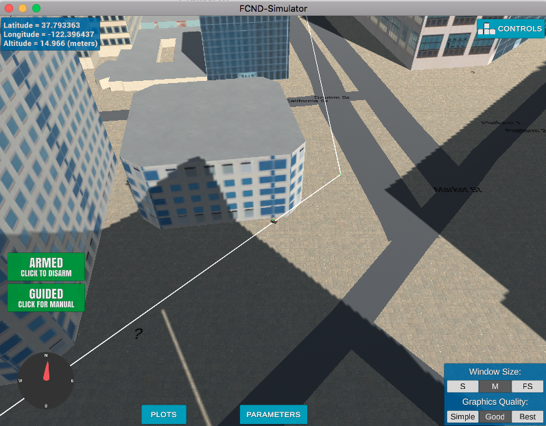

# FCND - 3D Motion Planning

### Explain the Starter Code
1. In motion_planning.py, Planning state is added between arming and takeoff. 
2. In backyard_flyer the plan was to move in predfined box. In the motion_planning.py, the plan_path function is invoked during planning state for generating waypoints.
3. plan_path function:
	- start position is set a -north_min, -east_min. It is random start position and works for this map. For other maps this start position may be out of grid. 
	- target position is set to (-north_min+10, -east_min+10)
	- Path from start to target is computed using the a_star algorithm provided in planning_util.py.
5. There is additional function in motion_planning.py named send_waypoint(). This functions sends waypoints to simulator. This enables simulator to visualise the waypoints flying vehicle can take.
6. planning_util.py has 2 functions:
	create_grid(): which takes the data and generates the grid. 
	a_star(): Used for planning path from start to goal state with 4 actions, N, E, W, S

### Implementing Your Path Planning Algorithm

#### 1. Set your global home position
Here students should read the first line of the csv file, extract lat0 and lon0 as floating point values and use the self.set_home_position() method to set global home. Explain briefly how you accomplished this in your code.

        with open('colliders.csv') as f:
            first_line = f.readline().strip().split(',')
    
        lat0 = float(first_line[0].strip().split(' ')[1])
        lon0 = float(first_line[1].strip().split(' ')[1])
        
        # TODO: set home position to (lon0, lat0, 0)
        self.set_home_position(lon0, lat0, 0.0)

#### 2. Set your current local position
Here as long as you successfully determine your local position relative to global home you'll be all set. Explain briefly how you accomplished this in your code.
	
		curr_global = [self._longitude, self._latitude, self._altitude]
	    (self.local_position[0], self.local_position[1], self.local_position[2]) = global_to_local(curr_global, self.global_home)

#### 3. Set grid start position from local position
This is another step in adding flexibility to the start location. As long as it works you're good to go!
	
		grid_start = (int(np.floor(self.local_position[0]))-north_offset, int(np.floor(self.local_position[1]))-east_offset)
   

#### 4. Set grid goal position from geodetic coords
This step is to add flexibility to the desired goal location. Should be able to choose any (lat, lon) within the map and have it rendered to a goal location on the grid.

		goal_lat = 37.794333
        goal_long = -122.396231
        
        target_position = global_to_local([goal_long, goal_lat, 0.0 ], self.global_home)
        grid_goal = (int(np.floor(target_position[0]))-north_offset, int(np.floor(target_position[1]))-east_offset)

#### 5. Modify A* to include diagonal motion (or replace A* altogether)
Minimal requirement here is to modify the code in planning_utils() to update the A* implementation to include diagonal motions on the grid that have a cost of sqrt(2), but more creative solutions are welcome. Explain the code you used to accomplish this step.

To achieve above,

	1. following actions were added
		NW = (-1,-1, np.sqrt(2))
	   	NE = (-1, 1, np.sqrt(2))
	    SW = (1, -1, np.sqrt(2))
	    SE = (1, 1, np.sqrt(2))

	2. Following conditions were added to remove invalid actions
		if x - 1 < 0 or  y - 1 < 0  or grid[x-1, y-1] == 1:
	        valid_actions.remove(Action.NW)
	    if x - 1 < 0 or  y + 1 > m or grid[x-1, y+1] == 1:
	        valid_actions.remove(Action.NE)
	    if x + 1 > n or  y - 1 < 0 or grid[x+1, y-1] == 1:
	        valid_actions.remove(Action.SW)
	    if x + 1 > n or  y + 1 > m or grid[x+1, y+1] == 1:
	        valid_actions.remove(Action.SE)

#### 6. Cull waypoints 
For this step you can use a collinearity test or ray tracing method like Bresenham. The idea is simply to prune your path of unnecessary waypoints. Explain the code you used to accomplish this step.
		
		
	Used collinearity test for the same.
	Also integrated probilistic roadmap in the same code, which can be enabled by setting flag
	self.isProbabilistic = True
		
	However in this mode the connecting graph takes time and due to which the sending waypoints hang because of timeout. Couldn't fix this issue and hence the current code is working with grid method along with digonal motion and collinearity pruning.
		
	Path length with or without pruning:
		Path length: 207
		Pruned path length: 26

 

### Execute the flight
#### 1. Does it work?
It works!